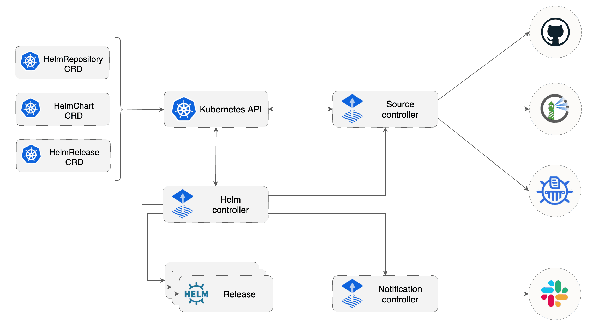

# helm-controller

The helm-controller is a Kubernetes operator, allowing one to declaratively
manage Helm chart releases. It is part of a composable [GitOps toolkit](https://toolkit.fluxcd.io)
and depends on [source-controller](https://github.com/fluxcd/source-controller)
to acquire the Helm charts from Helm repositories.

The desired state of a Helm release is described through a Kubernetes Custom
Resource named `HelmRelease`. Based on the creation, mutation or removal of a
`HelmRelease` resource in the cluster, Helm actions are performed by the
operator.

Features:

* watches for `HelmRelease` objects
* fetches artifacts produced by [source-controller](https://github.com/fluxcd/source-controller)
  from `Source` objects 
* watches `Source` objects for revision changes
* performs Helm actions as configured in the `HelmRelease`
* runs `HelmReleases` in a specific order, taking into account the depends-on relationship

Specifications:

* [API](docs/spec/v2alpha1/README.md)
* [Controller](docs/spec/README.md)
